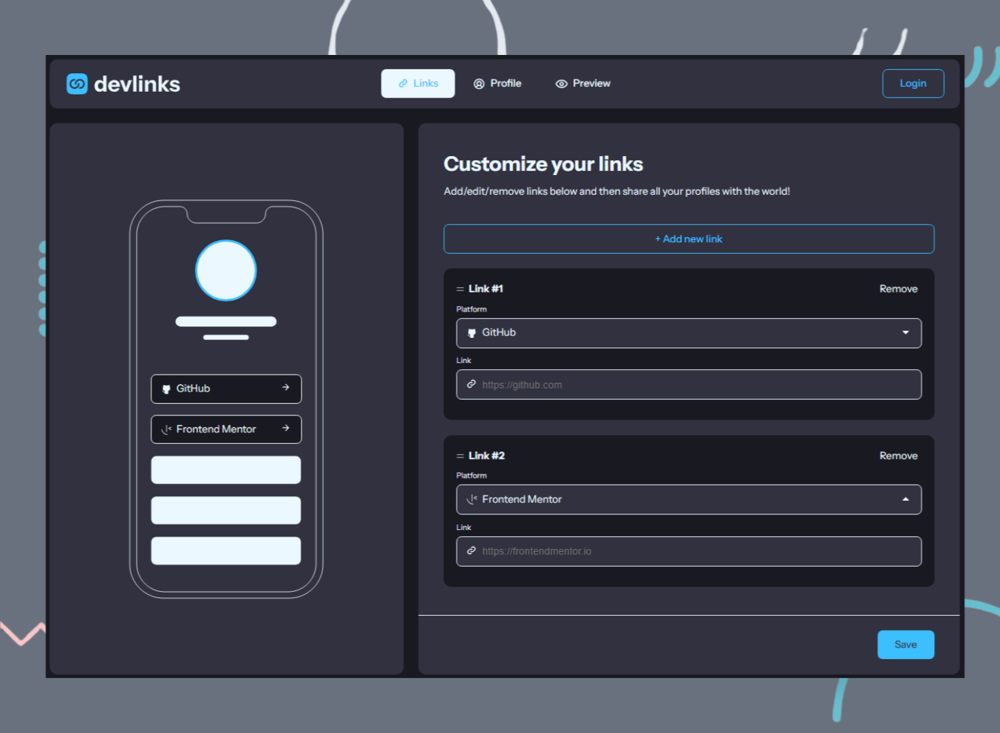

# Link-share
This project is a multi-page application that lets users gather and share all of their social links along with their profile using a single generated url. This is done using the client to handle all interactions as well as routing while the data persistence and user authentication is handled by Supabase. Users can interact with the application without loggin in, however to generate the unique url and allow sharing a new user must create an account and log in. 

## Table of contents

- [Link-share](#link-share)
  - [Table of contents](#table-of-contents)
  - [Overview](#overview)
    - [The challenge](#the-challenge)
    - [Screenshot](#screenshot)
    - [Links](#links)
  - [My process](#my-process)
    - [Built with](#built-with)
    - [What I learned](#what-i-learned)
    - [Continued development](#continued-development)
  - [Author](#author)
  - [Acknowledgments](#acknowledgments)

## Overview

### The challenge

The challenge was creating an application that allowed users to:

- Create, read, update, delete links and see previews in the mobile mockup
- Receive validations if the links form is submitted without a URL or with the wrong URL pattern for the platform
- Drag and drop links to reorder them
- Add profile details like profile picture, first name, last name, and email
- Receive validations if the profile details form is saved with no first or last name
- Preview their devlinks profile and copy the link to their clipboard
- View the optimal layout for the interface depending on their device's screen size
- See hover and focus states for all interactive elements on the page
- **Bonus**: Save details to a database (build the project as a full-stack app)
- **Bonus**: Create an account and log in (add user authentication to the full-stack app)

### Screenshot

### Links

- Solution URL: [Frontend Mentor](https://www.frontendmentor.io/profile/Geo-Bold)
- Live Site URL: [Pixel Gallery](https://geobold.dev/projects/link-share/)

## My process

### Built with

- Native HTML 5
- Native CSS
- Native JavaScript
- Flexbox
- CSS Grid
- Supabase
- [Custom Dropdown Select Menu](https://codepen.io/alvarotrigo/pen/QWmZYJr) by Alvaro

### What I learned

Over the last nine months, my aim for each project that I began was to follow the designers vision to the greatest degree possible. This taught me patience, for one, but also gave me control over each project to a high degree and forced me to find solutions to problems that would otherwise have gone ignored. This project was different. After purusing the Frontend Mentor discord, I stumbled upon several implementations such as [Curtis](https://github.com/webguy83) which left me stunned. Armed with this, I sought about planning the database schema as well as drawing out the UML diagrams.
>
My first divergence from the classic solution was the fact that I wanted the user to be able to interact with the application without having to create an account first or allow them access to a dev account. Accordingly, I planned to allow the user access to the application, but only generate the custom url and save the the database after authenticating.
>
My second idea was the creation of a multi-page application which had the unforseen consequence of having to deal with maintaining state across multiple pages. My solution was to encapsulate data in local storage and retrieve upon page load. Understanding that this by no means was the optimal solution, it gave me an opportunity to problem solve in a way that allowed me to learn, especially about state management and working with JSON data.
>
While the project is still a work in progress, I can am comfortable with moving past native JS and moving to the land of frameworks.

### Continued development

As of 09/11/2024 this project is still in development, requiring certain QoL features which are noted in my GitHub under issues.

## Author

- Website - [Geo Archbold](https://geobold.dev/)
- Frontend Mentor - [@Geo-Bold](https://www.frontendmentor.io/profile/Geo-Bold)

## Acknowledgments

A special thank you to [Anthony](https://github.com/anthonyisensee) for his incredible insights and support.
